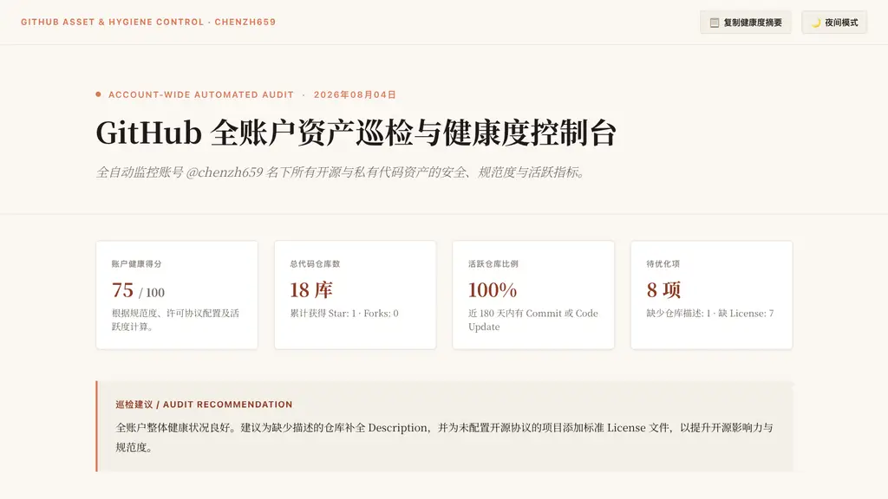
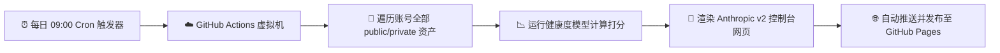

<div align="center">

# 📊 GitHub 全账户资产巡检与健康度控制台

<p align="center">
  <b>全自动监控名下所有开源与私有代码资产的安全、规范度与活跃指标</b>
</p>

[](https://github.com/chenzh659/github-account-dashboard/actions/workflows/daily_dashboard.yml)
[](https://chenzh659.github.io/github-account-dashboard/)
[](https://chenzh659.github.io/github-account-dashboard/)
[](https://www.python.org/)
[](LICENSE)

<br />

[🌐 在线即刻阅读网页版](https://chenzh659.github.io/github-account-dashboard/) · [💬 提交建议/Issue](https://github.com/chenzh659/github-account-dashboard/issues)

</div>

---

## 🖼️ 页面效果预览 (Live Preview)

下图为每日自动化生成的 **Anthropic 暖沙衬线社论风格** 健康度巡检控制台：

<div align="center">
  
</div>

---

## ✨ 核心亮点

- 🎨 **Anthropic 品牌级美学**：采用暖沙色纸质背景（`#FAF7F2`）、赤陶珊瑚红（`#D97757`）与经典衬线字体（Noto Serif SC / Merriweather）。
- 🌓 **Anthropic Daylight / Dusk 双主题**：支持在**日光暖沙**与**夜间深炭**模式无缝平滑切换。
- 📊 **多维健康度打分与资产盘点**：
  - 自动打分：根据规范度、许可协议配置及近半年活跃度为您打出健康得分；
  - 资产罗列：一目了然的总仓库数、Star、Fork 及核心编程语言分布；
  - 异常标记：智能筛选出“休眠 (Stale)”、“缺失协议 (No License)”及“无描述 (No Desc)”的项目。
- ⚙️ **完全无感云端运行**：基于 GitHub Actions 每天北京时间**早 9:00** 自动遍历全账户数据并部署到 GitHub Pages。

---

## 🔄 系统运行架构 (Architecture)



---

## 📁 目录结构

```text
github-account-dashboard/
├── .github/
│   └── workflows/
│       └── daily_dashboard.yml    # ⏰ 定时任务工作流 (每天早 9:00)
├── generate_dashboard.py          # 🐍 自动巡检与 HTML 渲染主脚本
├── index.html                     # 🌐 当前最新控制台主页
├── assets/
│   └── preview.png                # 🖼️ README 预览截图
├── reports/                       # 📂 历史巡检档案馆
│   └── 2026-08-04.html
└── README.md
```

---

<div align="center">
  <sub>Continuous inspection builds sustainable software engineering.</sub>
</div>
